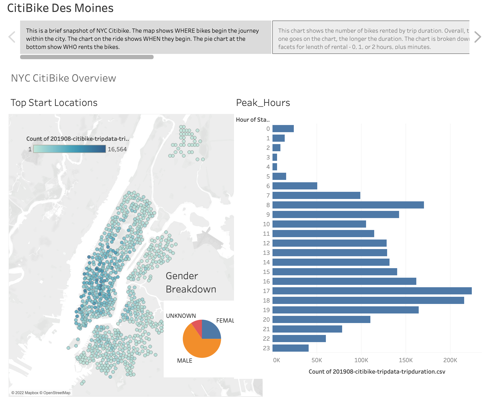
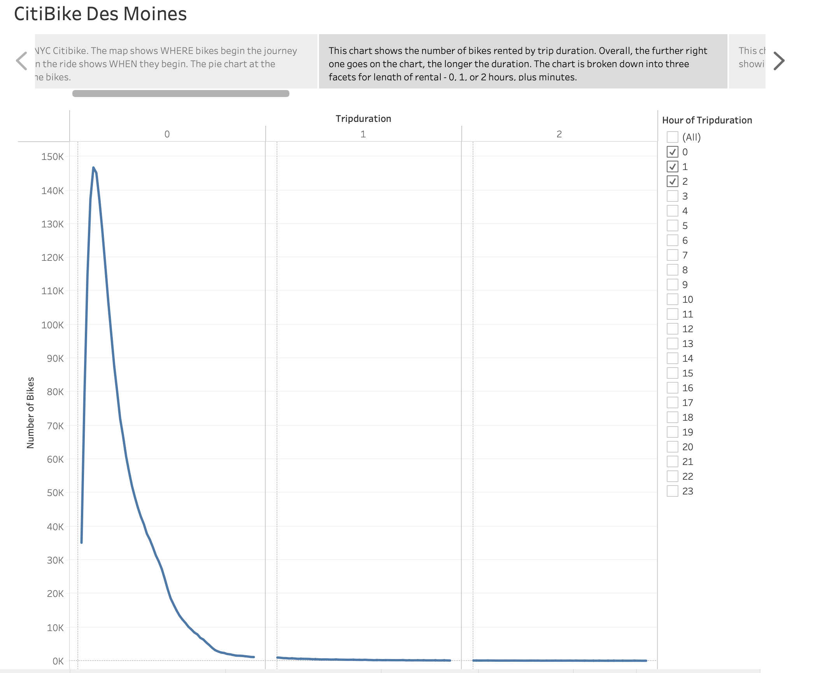
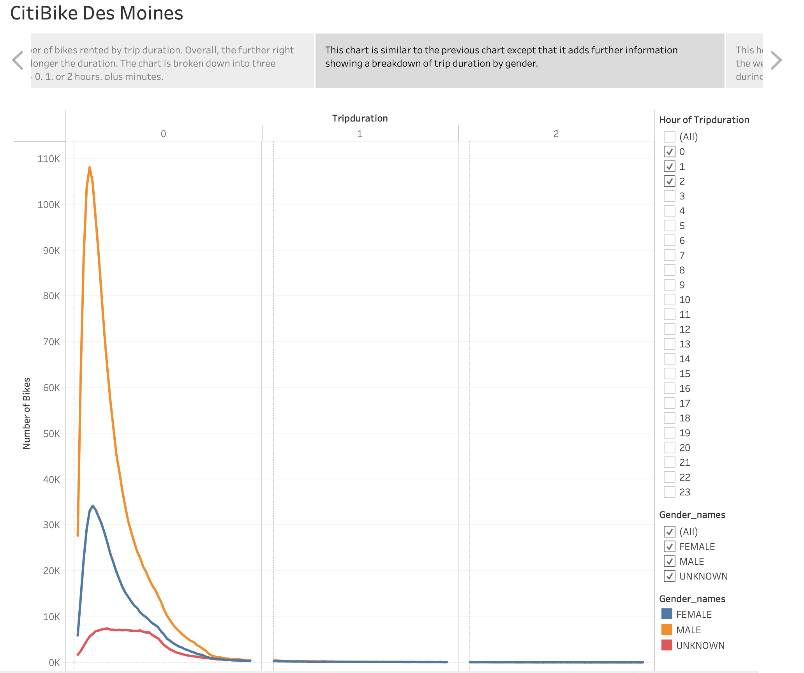
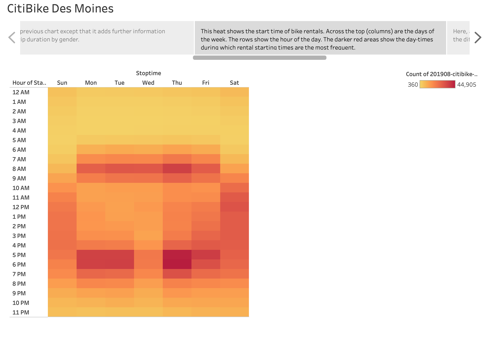
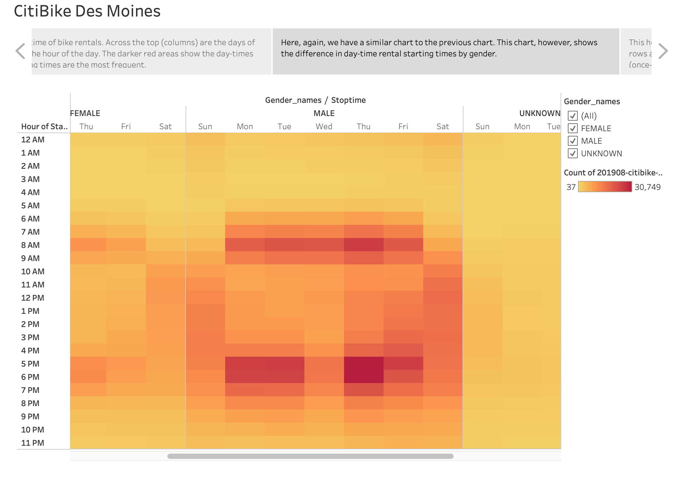
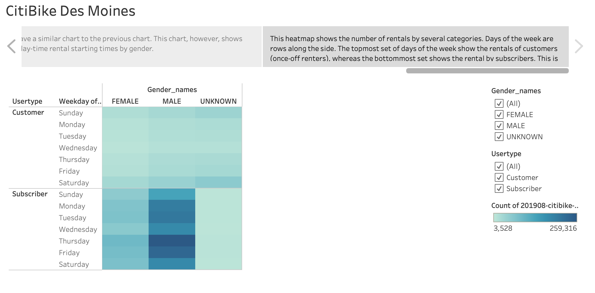

# bikesharing
BC Mod 14

## Overview
The purpose of this analysis is to provide actionable data for a potential
startup company in Des Moines, IA. The idea is to learn from CitiBike in New
York City, utilizing the data that they have provided, and to learn from their
metrics in order to replicate their success. In analyzing CitiBike's data, we
can see when, where, and who rents their bikes. This understanding will allow
our company to prepare for those types of demographics as we purchase bikes and
place them around our lovely Des Moines, ready for rental.

### Resources
* Tableau (Public)
* Python, using Pandas

## Results
The first slide in our story shows the following:  

This is a brief snapshot of NYC CitiBike. The map shows WHERE bikes begin the
journey within the city. The chart on the right shows WHEN they begin. The pie
chart at the bottom shows WHO rents the bikes.

N.B. This slide shows three different graphs from the module on one slide in the
slide deck.

The second slide shows Trip Duration.  

This chart shows the number of bikes rented by trip duration. Overall, the
further right one goes on the chart, the longer the duration. The chart is
broken down into three facets for length of rental: 0, 1, or 2 hours, plus
minutes. Some rentals went longer than 2 hours and 59 minutes, but they make up
a very small part of the dataset.

The third slide shows Trip Duration by Gender.  

This chart is similar to the previous chart except that it adds further
information showing a breakdown of trip duration by gender.

The fourth slide shows a rental heatmap.  

This heatmap shows the start time of bike rentals. Across the top (columns) are
the days of the week. The rows show the hour of the day. The darker red areas
show the day-times during which rental starting times are the most frequent.

The fifth slide shows a rental heatmap by gender.  

Here, again, we have a similar heatmap to the previous heatmap. This chart,
however, shows the difference in day-time rental starting times by gender.

The sixth slide shows a rental heatmap by user type.  

This heatmap shows the number of rentals by several categories. Days of the week
are rows along the side. The topmost set of days of the week show the rentals of
customers (once-off renters), wehereas the bottommost set shows the rentals by
subscribers. This is further divided by the columns displaying gener disclosure
information. the darker the blue area in this heatmap, the higher the number of
bike rentals.

The Tableau Story described above can be found here:
[Tableau_story](https://public.tableau.com/app/profile/cory.peacock/viz/BCMod14_Challenge/CitiBikeDesMoines)  

## Summary
The data analyzed from NYC CitiBike has been very informative. The greatest
number of rentals occurs in the early morning (6-9 am) and evening (6-9 pm). Men
make up the majority of their renters, and subscribers make up a significantly
higher proportion of the overall number of rentals. This is a little surprising
in a city such as New York city.

Given our analysis, this bodes well for the CitiBike proposal we are making for
Des Moines, given that once-off renters (presumably heavily featuring tourists)
do not make up the bulk of NYC CitiBike's rentals. Presumably, Des Moines would
not generate the same volume of tourists as New York, so it is a positive
that NYC CitiBike does not rely on tourist rentals.

Two additional visualizations within the given dataset that would prove
beneficial to our potential investors would be the following:

1. Number of repairs per bike. This would provide an understanding of how often
bikes are being repaired.
2. This previous visualization should be couple with repair per bike based on
minutes rented. This would provide information on how long we could assume bike
would last on average between repairs. This might also inform whether bikes
should be rotated between starting locations show that bike usage would be
spread most effectively among the bikes in inventory.
